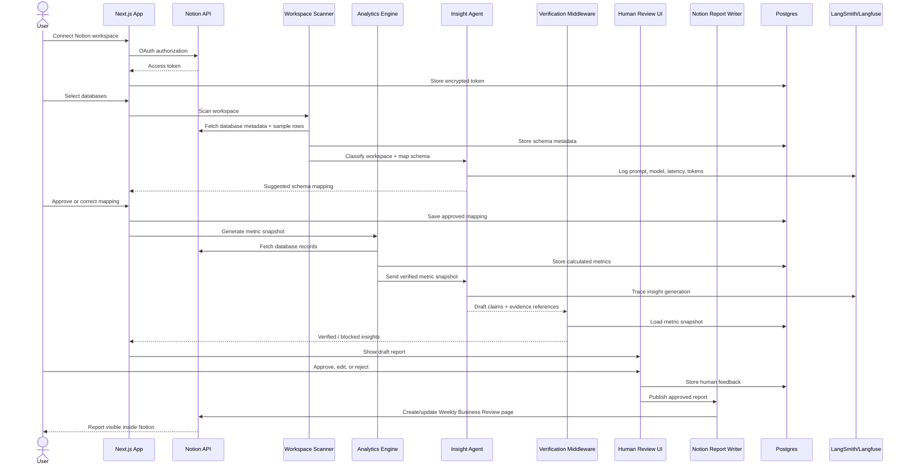
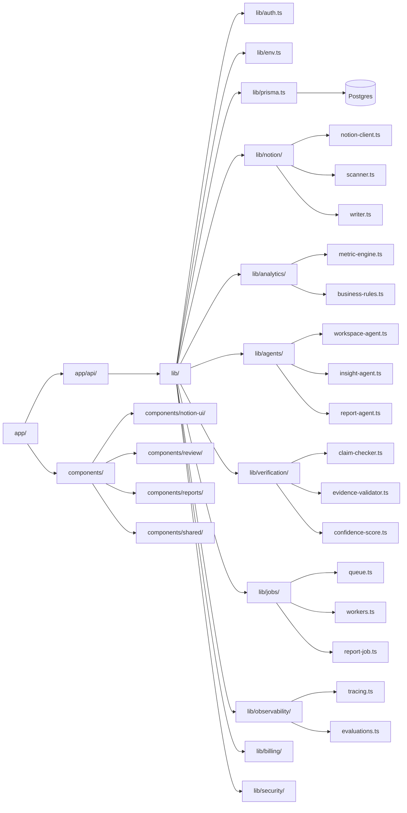

# ARCHITECTURE.md

# AI Business Analyst for Notion — Mermaid Architecture Diagram

```mermaid
flowchart TD

%% =========================
%% USER + CLIENT LAYER
%% =========================

U[User / Small Business Owner] -->|Visits app| WEB[Next.js Web App]

WEB --> MKT[Marketing Page]
WEB --> APP[Protected App Area]

APP --> ONBOARD[Onboarding UI]
APP --> DASH[Dashboard / Review UI]
APP --> SETTINGS[Settings + Billing UI]

ONBOARD --> CONNECT[Connect Notion Card]
ONBOARD --> DBSELECT[Database Selector]
ONBOARD --> SCHEMAREVIEW[Schema Review UI]

DASH --> DRAFTVIEW[Draft Business Review]
DASH --> HITL[Human-in-the-Loop Review]
HITL --> APPROVE[Approve Report]
HITL --> EDIT[Edit Insight / Action]
HITL --> REJECT[Reject Unsupported Claim]

SETTINGS --> BILLING[Stripe Billing Portal]
SETTINGS --> SCHEDULE[Report Schedule Settings]

%% =========================
%% AUTH
%% =========================

WEB --> AUTH[Clerk Auth]
AUTH --> USERDB[(Postgres User Records)]

%% =========================
%% NEXT.JS API LAYER
%% =========================

APP --> API[Next.js API Routes]

API --> HEALTH[/api/health/]
API --> NOTIONAPI[/api/notion/*/]
API --> ANALYSISAPI[/api/analysis/*/]
API --> REPORTAPI[/api/reports/*/]
API --> VERIFYAPI[/api/verification/*/]
API --> JOBAPI[/api/jobs/report/]
API --> BILLINGAPI[/api/billing/*/]

%% =========================
%% NOTION CONNECTION
%% =========================

NOTIONAPI --> OAUTH[Notion OAuth Handler]
OAUTH --> NOTIONAUTH[Notion OAuth]
NOTIONAUTH --> TOKEN[Encrypted Notion Token]

TOKEN --> ENC[Encryption Service]
ENC --> PG[(Postgres)]

NOTIONAPI --> NCLIENT[Notion Client]
NCLIENT --> NOTION[Notion API]

NOTION --> WORKSPACE[User Notion Workspace]
WORKSPACE --> NDBS[Notion Databases]
WORKSPACE --> NPAGES[Notion Pages]

%% =========================
%% WORKSPACE SCANNING
%% =========================

NCLIENT --> SCANNER[Workspace Scanner]
SCANNER --> DBMETA[Database Metadata]
SCANNER --> SAMPLE[Sample Rows]
SCANNER --> RELATIONS[Relations + Property Types]

DBMETA --> PG
SAMPLE --> PG
RELATIONS --> PG

SCANNER --> WAGENT[Workspace Analyzer Agent]
WAGENT --> SCHEMAMAP[AI Schema Mapping]

SCHEMAMAP --> SCHEMAREVIEW
SCHEMAREVIEW -->|User confirms / edits| MAPPING[Approved Schema Mapping]
MAPPING --> PG

%% =========================
%% ANALYTICS TRUTH LAYER
%% =========================

MAPPING --> NORMALIZER[Data Normalizer]
NDBS --> NORMALIZER

NORMALIZER --> METRICENGINE[Analytics Metric Engine]

METRICENGINE --> REVENUE[Revenue Metrics]
METRICENGINE --> PROFIT[Profit Metrics]
METRICENGINE --> INVENTORY[Inventory Aging]
METRICENGINE --> GROWTH[Growth Trends]
METRICENGINE --> COMPLETION[Project Completion]
METRICENGINE --> CUSTOMER[Customer Activity]

REVENUE --> SNAPSHOT[Metric Snapshot]
PROFIT --> SNAPSHOT
INVENTORY --> SNAPSHOT
GROWTH --> SNAPSHOT
COMPLETION --> SNAPSHOT
CUSTOMER --> SNAPSHOT

SNAPSHOT --> PG

%% =========================
%% AI INSIGHT LAYER
%% =========================

SNAPSHOT --> INSIGHTAGENT[Insight Agent]

INSIGHTAGENT --> AIAPI[Claude / OpenAI API]
AIAPI --> CLAIMS[Draft AI Claims]

CLAIMS --> CLAIMSTORE[(AIClaim Records)]
CLAIMSTORE --> PG

%% =========================
%% VERIFICATION LAYER
%% =========================

CLAIMS --> VERIFIER[Verification Middleware]

VERIFIER --> CLAIMCHECK[Claim Checker]
VERIFIER --> EVIDENCE[Evidence Validator]
VERIFIER --> CONFIDENCE[Confidence Scorer]

CLAIMCHECK --> SNAPSHOT
EVIDENCE --> SNAPSHOT
CONFIDENCE --> VERDICT[Verification Result]

VERDICT -->|Pass| VERIFIED[Verified Insight]
VERDICT -->|Fail| BLOCKED[Blocked / Needs Review]
VERDICT --> PG

BLOCKED --> HITL
VERIFIED --> REPORTAGENT[Report Writer Agent]

%% =========================
%% HUMAN REVIEW
%% =========================

REPORTAGENT --> DRAFT[Report Draft]
DRAFT --> PG
DRAFT --> DRAFTVIEW

EDIT --> DRAFT
REJECT --> FEEDBACK[Human Feedback]
APPROVE --> FINALREPORT[Approved Report]

FEEDBACK --> PG
FINALREPORT --> PG

%% =========================
%% NOTION REPORT WRITER
%% =========================

FINALREPORT --> NWRITER[Notion Report Writer]

NWRITER --> BLOCKBUILDER[Notion Block Builder]
BLOCKBUILDER --> SUMMARY[Summary Blocks]
BLOCKBUILDER --> METRICBLOCKS[Metric Blocks]
BLOCKBUILDER --> WARNINGBLOCKS[Warning Blocks]
BLOCKBUILDER --> ACTIONBLOCKS[Checkbox Action Items]

SUMMARY --> NOTION
METRICBLOCKS --> NOTION
WARNINGBLOCKS --> NOTION
ACTIONBLOCKS --> NOTION

NOTION --> REPORTPAGE[🤖 Weekly Business Review Page in Notion]

%% =========================
%% BUSINESS MEMORY
%% =========================

FINALREPORT --> MEMORY[Business Memory Service]
MEMORY --> HISTORY[Historical Reports]
HISTORY --> PG

HISTORY --> REPEATED[Repeated Problem Detector]
REPEATED --> INSIGHTAGENT

%% =========================
%% JOBS + SCHEDULING
%% =========================

SCHEDULE --> QUEUE[BullMQ Queue]
JOBAPI --> QUEUE

QUEUE --> REDIS[(Redis / Upstash)]
QUEUE --> WORKER[Report Worker]

WORKER --> SCANNER
WORKER --> METRICENGINE
WORKER --> INSIGHTAGENT
WORKER --> VERIFIER
WORKER --> REPORTAGENT

%% =========================
%% BILLING
%% =========================

BILLINGAPI --> STRIPE[Stripe API]
STRIPE --> SUBSCRIPTION[Subscription Status]
SUBSCRIPTION --> PG

SUBSCRIPTION --> ENTITLEMENTS[Entitlements Service]
ENTITLEMENTS --> API

%% =========================
%% OBSERVABILITY
%% =========================

API --> LOGGER[Structured Logger]
WORKER --> LOGGER
INSIGHTAGENT --> TRACE[AI Tracing]
VERIFIER --> TRACE
REPORTAGENT --> TRACE

TRACE --> LANG[LangSmith / Langfuse]
LOGGER --> SENTRY[Sentry]
LOGGER --> POSTHOG[PostHog Product Analytics]

TRACE --> RUNS[AgentRun Records]
RUNS --> PG

%% =========================
%% EVALS
%% =========================

EVALS[AI Eval Suite] --> GOLDEN[Golden Test Datasets]
GOLDEN --> EVALRUNNER[Eval Runner]
EVALRUNNER --> INSIGHTAGENT
EVALRUNNER --> VERIFIER
EVALRUNNER --> EVALRESULTS[Eval Results]

EVALRESULTS --> PG

%% =========================
%% DEPLOYMENT
%% =========================

GITHUB[GitHub Repository] --> ACTIONS[GitHub Actions CI/CD]
ACTIONS --> VERCEL[Vercel Deployment]
VERCEL --> WEB

PG -. hosted by .-> NEON[Neon / Supabase Postgres]
REDIS -. hosted by .-> UPSTASH[Upstash Redis]

%% =========================
%% CORE PRINCIPLE
%% =========================

PRINCIPLE[Core Rule: Notion = system of record<br/>Analytics Engine = truth<br/>AI = interpretation<br/>Verifier = safety<br/>Human = final approval]

PRINCIPLE -. governs .-> METRICENGINE
PRINCIPLE -. governs .-> INSIGHTAGENT
PRINCIPLE -. governs .-> VERIFIER
PRINCIPLE -. governs .-> HITL
```

---

## Simplified Agent Pipeline

```mermaid
sequenceDiagram
    actor User
    participant Web as Next.js App
    participant Notion as Notion API
    participant Scanner as Workspace Scanner
    participant Metrics as Analytics Engine
    participant AI as Insight Agent
    participant Verify as Verification Middleware
    participant Review as Human Review UI
    participant Writer as Notion Report Writer
    participant DB as Postgres
    participant Trace as LangSmith/Langfuse

    User->>Web: Connect Notion workspace
    Web->>Notion: OAuth authorization
    Notion-->>Web: Access token
    Web->>DB: Store encrypted token

    User->>Web: Select databases
    Web->>Scanner: Scan workspace
    Scanner->>Notion: Fetch database metadata + sample rows
    Scanner->>DB: Store schema metadata

    Scanner->>AI: Classify workspace + map schema
    AI->>Trace: Log prompt, model, latency, tokens
    AI-->>Web: Suggested schema mapping
    User->>Web: Approve or correct mapping
    Web->>DB: Save approved mapping

    Web->>Metrics: Generate metric snapshot
    Metrics->>Notion: Fetch database records
    Metrics->>DB: Store calculated metrics

    Metrics->>AI: Send verified metric snapshot
    AI->>Trace: Trace insight generation
    AI-->>Verify: Draft claims + evidence references

    Verify->>DB: Load metric snapshot
    Verify-->>Web: Verified / blocked insights

    Web->>Review: Show draft report
    User->>Review: Approve, edit, or reject
    Review->>DB: Store human feedback

    Review->>Writer: Publish approved report
    Writer->>Notion: Create/update Weekly Business Review page
    Notion-->>User: Report visible inside Notion
```

---

## Codebase Dependency Map

```mermaid
flowchart LR

APP[app/] --> COMPONENTS[components/]
APP --> API[app/api/]
API --> LIB[lib/]

COMPONENTS --> NOTIONUI[components/notion-ui/]
COMPONENTS --> REVIEWUI[components/review/]
COMPONENTS --> REPORTUI[components/reports/]
COMPONENTS --> SHARED[components/shared/]

LIB --> AUTH[lib/auth.ts]
LIB --> ENV[lib/env.ts]
LIB --> PRISMA[lib/prisma.ts]

LIB --> NOTIONLIB[lib/notion/]
LIB --> ANALYTICSLIB[lib/analytics/]
LIB --> AGENTSLIB[lib/agents/]
LIB --> VERIFYLIB[lib/verification/]
LIB --> JOBSLIB[lib/jobs/]
LIB --> OBSLIB[lib/observability/]
LIB --> BILLINGLIB[lib/billing/]
LIB --> SECURITYLIB[lib/security/]

NOTIONLIB --> NOTIONCLIENT[notion-client.ts]
NOTIONLIB --> SCANNER[scanner.ts]
NOTIONLIB --> WRITER[writer.ts]

ANALYTICSLIB --> METRICS[metric-engine.ts]
ANALYTICSLIB --> RULES[business-rules.ts]

AGENTSLIB --> WORKSPACEAGENT[workspace-agent.ts]
AGENTSLIB --> INSIGHTAGENT[insight-agent.ts]
AGENTSLIB --> REPORTAGENT[report-agent.ts]

VERIFYLIB --> CLAIMCHECKER[claim-checker.ts]
VERIFYLIB --> EVIDENCEVALIDATOR[evidence-validator.ts]
VERIFYLIB --> CONFIDENCE[confidence-score.ts]

JOBSLIB --> QUEUE[queue.ts]
JOBSLIB --> WORKERS[workers.ts]
JOBSLIB --> REPORTJOB[report-job.ts]

OBSLIB --> TRACING[tracing.ts]
OBSLIB --> EVALS[evaluations.ts]

PRISMA --> DATABASE[(Postgres)]
```
